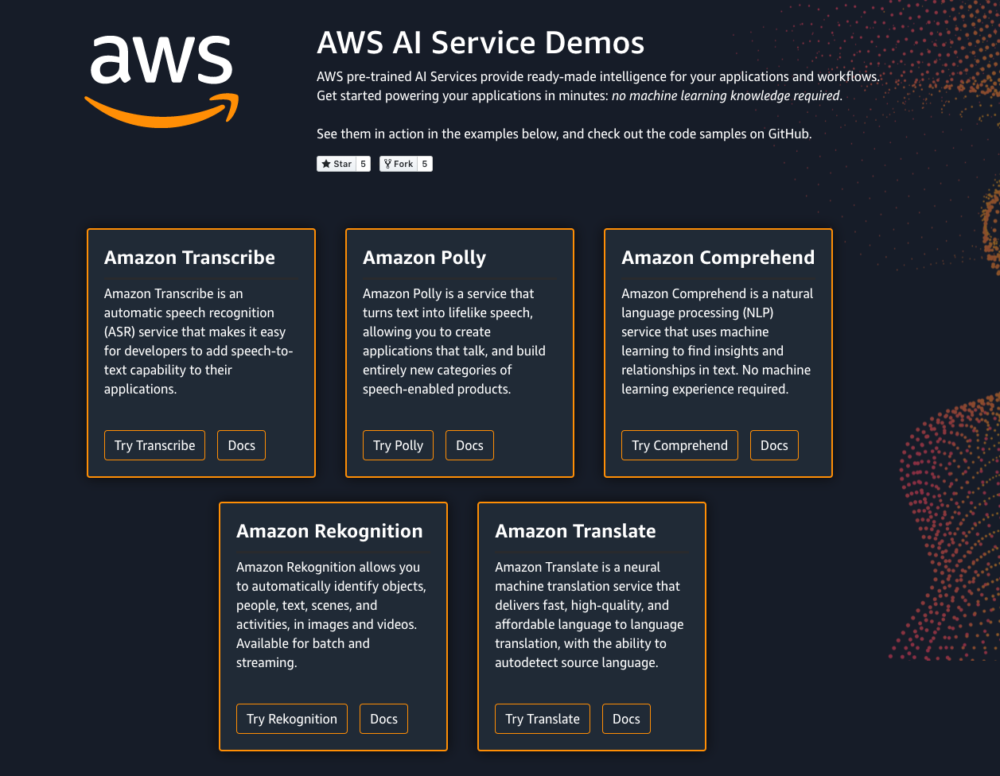

# AWS AI Service Demos

Try out various AI services from AWS, no code or account required. 

Demo site hosted at [https://ai-service-demos.go-aws.com](https://ai-service-demos.go-aws.com)

### Included examples:

All components available in `src/components/`

- [Amazon Transcribe](https://ai-service-demos.go-aws.com/transcribe)
    - `Transcribe.js`: Batch async transcription job for custom audio
- [Amazon Polly](https://ai-service-demos.go-aws.com/polly)
    - `Polly.js`: Text to speech with standard or neural voice engine across all available languages
- [Amazon Comprehend](https://ai-service-demos.go-aws.com/comprehend)
    - `Comprehend.js`: Sentiment, Entity, Key Phrase, and Syntax Token detection
- [Amazon Rekognition](https://ai-service-demos.go-aws.com/rekognition)
    - `Rekognition.js`: Object detection
- [Amazon Translate](https://ai-service-demos.go-aws.com/translate)
    - `Translate.js`: Text to text translate
- [Amazon Textract](https://ai-service-demos.go-aws.com/textract)
    - `Textract.js`: Text Detection

### Installing

To run/test locally:

`npm install`

`npm start`

`https://localhost:3000`

## AWS AI Service Free Tiers

The services covered in this demo all have very generous free tiers. At a glance:

| Service            | Description                    | Quantity                       | 
|--------------------|--------------------------------|--------------------------------|
| Amazon Translate   | Text-Text Translation          | 2 million characters/month     |
| Amazon Polly       | Text to Speech                 | 5 million characters/month     |
| Amazon Comprehend  | Natural Language Understanding | 5 million characters/API/month | 
| Amazon Rekognition | Computer Vision                | 5k images/month                | 
| Amazon Transcribe  | Audio to Text Transcription    | 60 minutes/month               |  
| Amazon Textract    | Document Text Extraction       | 1000 pages/month (free trial)  |  

For the most up-to-date info on free tier status, check out [the live pricing page here](https://aws.amazon.com/free/).

## Built With

* [AWS AI Services](https://aws.amazon.com/machine-learning/ai-services/) - Fully managed AI services, on a pay-per-use model.
* [AWS Amplify](https://aws.amazon.com/amplify/) - Development toolchain for building and deploying webapps

## Contributing

Have functionality you'd like to see, or a new AI service you want a demo for? Ping me on Twitter ([@TheNickWalsh](https://twitter.com/thenickwalsh)] or open an issue here.

## License

This project is licensed under the MIT License - see the [LICENSE.md](LICENSE.md) file for details

## Acknowledgments

* Thanks to [Nicki Stone](https://twitter.com/kneekey23) for the late night javascript help
